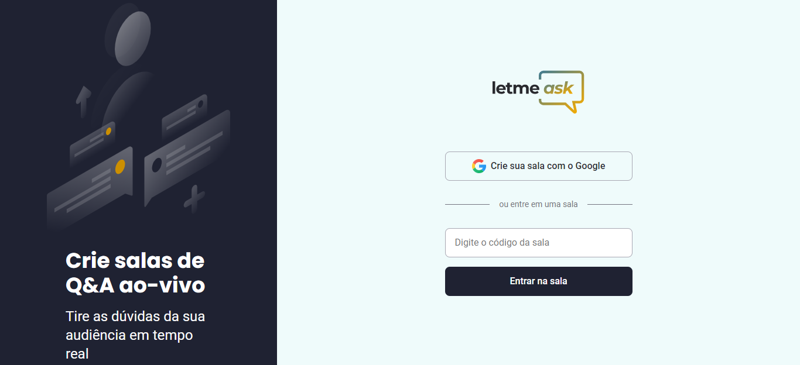
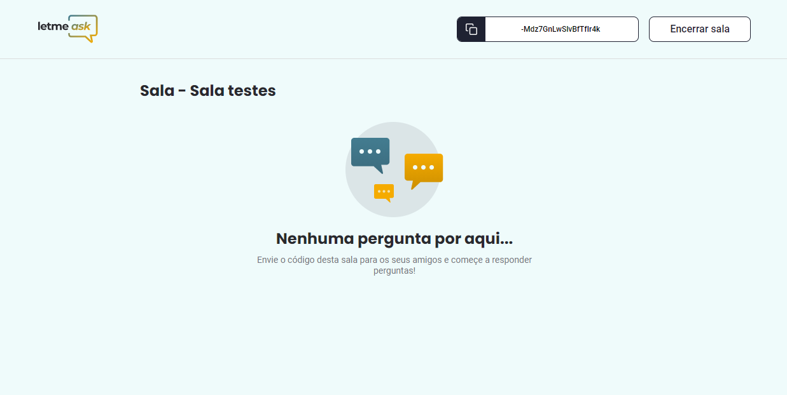
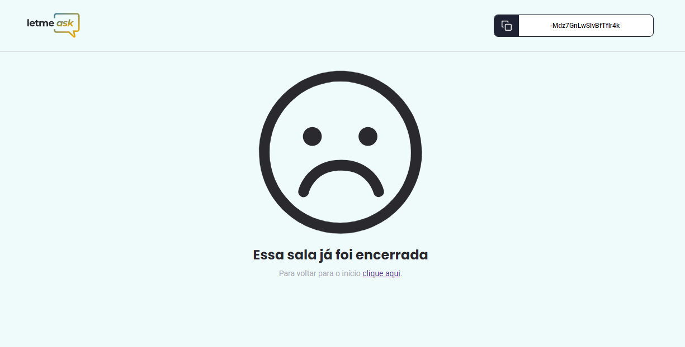
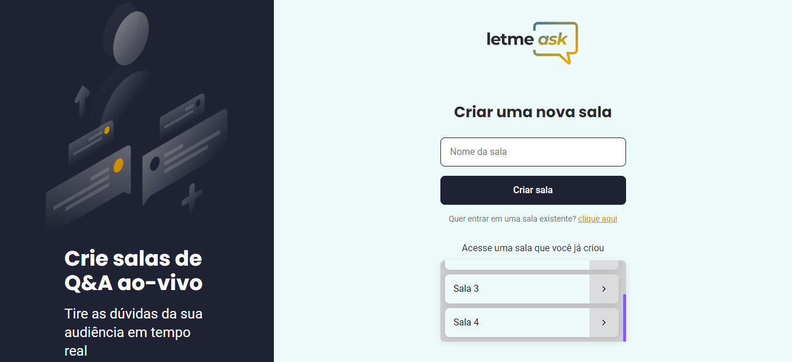
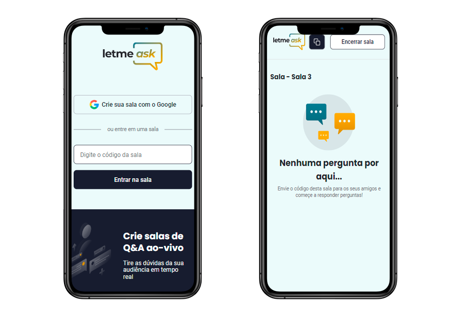

  

  
  
  

     

<h1 align="center">
    
</h1>

 

## 🧪 Tecnologias

Esse projeto foi desenvolvido com as seguintes tecnologias:

- [React](https://reactjs.org)
- [Firebase](https://firebase.google.com/)
- [TypeScript](https://www.typescriptlang.org/)

## 💻 Projeto

Letmeask é perfeito para criadores de conteúdos poderem criar salas de Q&A com o seu público, de uma forma muito organizada e democrática. 

Este é um projeto desenvolvido durante a **[Next Level Week Together](https://nextlevelweek.com/)**, apresentada dos dias 20 a 27 de Junho de 2021.

## 🆙 Acrescentado ao projeto original

Foi adicionado algumas features ao projeto original desenvolvido durante a Next Level Week Together:

#### Impedir que um convidade acesse a sala como administrador

#### Mensagem alternativa caso não haja perguntas na sala

<h1 align="center">
    
</h1>

#### Mensagem alternativa caso a sala tenha sido encerrada

<h1 align="center">
    
</h1>

#### Listagem das salas criadas e ainda ativas do usuário logado

<h1 align="center">
    
</h1>

#### Layout responsivo

<h1 align="center">
    
</h1>

## 🔖 Link do projeto

Acesse o projeto em produção:

- [Letmeask](https://letmeask-826d8.web.app/) 
